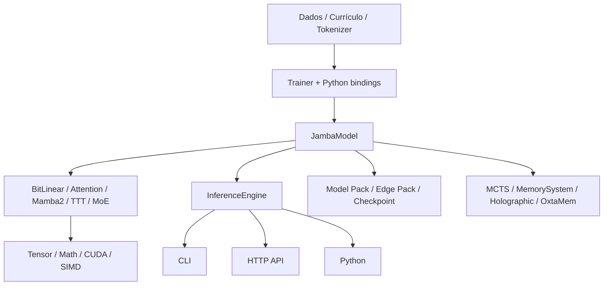
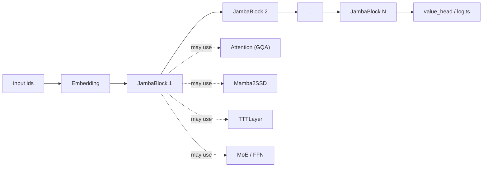
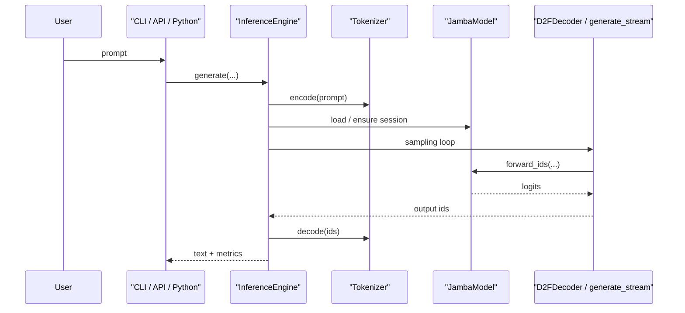
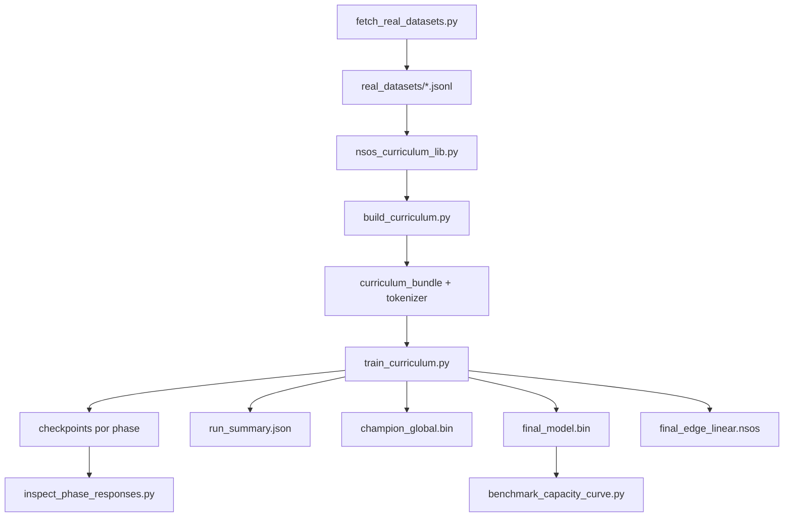

# NSOS Deep Dive

Documento de referência aprofundado do projeto `NSOS`, escrito a partir do próprio código-fonte presente em:

- `C:\Users\Oxta\Desktop\reimagined-main\OXN\nsos\include`
- `C:\Users\Oxta\Desktop\reimagined-main\OXN\nsos\src`
- `C:\Users\Oxta\Desktop\reimagined-main\OXN\nsos\scripts`
- `C:\Users\Oxta\Desktop\reimagined-main\OXN\nsos\tests`
- `C:\Users\Oxta\Desktop\reimagined-main\OXN\nsos\CMakeLists.txt`
- `C:\Users\Oxta\Desktop\reimagined-main\OXN\nsos\README.md`

Este material foi pensado para ser o documento mais mastigado possível sobre o projeto: o que ele é, como é construído, como os módulos se conectam, o que cada parte faz, quais são as superfícies públicas, onde entram treino, inferência, memória, reasoning, API, bindings Python, pacotes de modelo, currículo e testes.

O objetivo aqui não é vender o projeto. É descrevê-lo com fidelidade técnica.

---

## Sumário

1. Visão geral do projeto
2. O que é o NSOS na prática
3. Estrutura do repositório
4. Superfícies oficiais do produto
5. Build system e alvos gerados
6. Camada fundacional: tipos, tensores, parâmetros e contexto
7. Camada matemática e de performance
8. Arquitetura do modelo
9. Runtime de inferência
10. Runtime de treino
11. Tokenização e dados
12. Memória, raciocínio e ecossistema cognitivo
13. API HTTP, CLI e bindings Python
14. Scripts operacionais e pipeline de artefatos
15. Testes e validação
16. Como tudo interage ponta a ponta
17. Módulos satélite, experimentais e auxiliares
18. Apêndice: catálogo de classes e funções principais

---

## 1. Visão geral do projeto

`NSOS` é o runtime neural central do repositório. Ele não é apenas "um modelo". Ele é um ecossistema composto por:

- uma base tensorial CPU/GPU;
- um conjunto de blocos neurais próprios;
- uma arquitetura híbrida centrada em `JambaModel`;
- um runtime de treino e inferência;
- uma camada de export/import de checkpoint e model pack;
- uma API HTTP oficial;
- um CLI oficial;
- bindings Python via `pybind11`;
- mecanismos de memória, reasoning e swarm;
- um pipeline de currículo para treinar modelos pequenos especializados;
- uma suíte de testes nativos;
- um conjunto de scripts de benchmark, inspeção e validação.

O centro do projeto, hoje, é a biblioteca `nsos_core`, a partir da qual quase todo o resto é construído.

### Visão macro

---

## 2. O que é o NSOS na prática

No código atual, o NSOS pode ser entendido simultaneamente como cinco coisas:

### 2.1. Uma biblioteca neural em C++

Ela define:

- `Tensor`
- `Parameter`
- `Module`
- camadas
- otimizadores
- serialização
- geração de texto
- treino supervisionado
- reasoning e memória

### 2.2. Uma arquitetura de modelo

A arquitetura principal está em torno de:

- `Embedding`
- `BitLinear`
- `Attention`
- `Mamba2SSD`
- `TTTLayer`
- `MoERouter`
- `JambaBlock`
- `JambaModel`

### 2.3. Um runtime de produto

O projeto já expõe:

- `InferenceEngine`
- `nsos_cli`
- `nsos_api_server`
- `nsos_ext` para Python

### 2.4. Um pipeline de treino especializado

Com currículo por fases:

- `phase1_algorithms`
- `phase2_structured`
- `phase3_curated_text`
- `phase4_instructions`
- `phase5_verifier`
- `phase6_memory`

### 2.5. Um laboratório de extensões cognitivas

O projeto também contém componentes que expandem o escopo de um "LLM comum":

- `MCTSReasoning`
- `MemorySystem`
- `HolographicMemory`
- `CausalMemoryStore`
- `OxtaMemFFI`
- `Coordinator` / `Mailbox` / swarm
- `NeuralSelfHealer`

---

## 3. Estrutura do repositório

O diretório `C:\Users\Oxta\Desktop\reimagined-main\OXN\nsos` mistura código-fonte, builds, artefatos, scripts e documentação.

### 3.1. Diretórios mais importantes

- `include/`
  - headers do runtime e da arquitetura.
- `src/`
  - implementação C++ principal.
- `scripts/`
  - pipeline Python de currículo, treino, inspeção, benchmark e datasets.
- `tests/`
  - testes nativos C++.
- `python/nsos/`
  - pacote Python leve com wrapper e contrato.
- `docs/`
  - documentação de roadmap, validação e agora este deep dive.
- `artifacts/`
  - bundles, runs, packs, checkpoints, datasets reais, logs.
- `benchmarks/`
  - suites de benchmark curtas.

### 3.2. Diretórios de build

O projeto contém vários builds locais, por exemplo:

- `build`
- `build_clean`
- `build_cuda129`
- `build_v1`
- `build_swarm`
- `build_ultra`

Esses diretórios não representam módulos conceituais do NSOS; eles representam iterações de build e experimentação operacional.

### 3.3. Regra prática para entender o que está "ativo"

A melhor fonte de verdade para saber o que faz parte do core atualmente é:

- `C:\Users\Oxta\Desktop\reimagined-main\OXN\nsos\CMakeLists.txt`

Em especial a lista `NSOS_CORE_SOURCES`, que define o que entra no target `nsos_core`.

---

## 4. Superfícies oficiais do produto

Segundo o `README.md`, a interface oficial v1 hoje é a API HTTP.

### 4.1. Biblioteca central

- `nsos_core`

É o coração do sistema. Todos os executáveis e bindings principais ligam contra ela.

### 4.2. API HTTP oficial

- executável: `nsos_api_server`
- base: `src/api_server.cpp` + `src/http_api_server.cpp`

### 4.3. CLI oficial

- executável: `nsos_cli`
- base: `src/nsos_cli.cpp`

### 4.4. Binding Python

- módulo: `nsos_ext`
- base: `src/bindings.cpp`

### 4.5. Artefatos de modelo

O projeto trabalha com múltiplos tipos de artefato:

- checkpoint binário do modelo
- tokenizer pack
- model pack
- edge linear pack
- currículo serializado
- summaries e manifests de run

---

## 5. Build system e alvos gerados

O arquivo `CMakeLists.txt` organiza o projeto em torno de opções explícitas.

### 5.1. Opções principais

- `NSOS_ENABLE_CUDA`
- `NSOS_BUILD_PYTHON`
- `NSOS_BUILD_TESTS`
- `NSOS_BUILD_CIRCUIT_TOOLS`
- `NSOS_BUILD_CLI`
- `NSOS_BUILD_API`
- `NSOS_BUILD_OXTAMEM`
- `NSOS_ENABLE_TURBOQUANT`

### 5.2. Dependências previstas

- C++20
- OpenMP
- CUDA opcional
- `pybind11` para Python
- Python3 para build do binding
- Cargo opcional para o motor OxtaMem
- Zig opcional para TurboQuant externo

### 5.3. Targets relevantes

- `nsos_core`
- `nsos_ext`
- `nsos_circuit_trainer`
- `nsos_cli`
- `nsos_api_server`
- `oxtamem_engine` como custom target opcional
- múltiplos testes nativos

### 5.4. Papel do `nsos_core`

`nsos_core` é uma biblioteca estática que agrega:

- tensores
- math ops
- arquitetura Jamba
- Mamba2
- BitLinear / BitNetAdapter
- Embedding
- KAN
- TTT
- Trainer
- Tokenizer
- InferenceEngine
- MemorySystem
- HolographicMemory
- MCTS
- HTTP server
- SmartLoader
- SprecherKAN
- swarm coordinator
- self-healer
- numerical guard
- fallback de TurboQuant

Isso significa que, conceitualmente, o NSOS é distribuído como um runtime único, e não como dezenas de bibliotecas pequenas desacopladas.

---

## 6. Camada fundacional: tipos, tensores, parâmetros e contexto

Esta é a base sobre a qual o resto se apoia.

### 6.1. `nsos_config.h`

Arquivo-chave: `include/nsos_config.h`

Define:

- `Device`
  - `CPU`
  - `GPU`
- `ModelConfig`

`ModelConfig` é o contrato de configuração unificado do runtime. Ele concentra:

- tamanho do modelo (`num_layers`, `d_model`, `vocab_size`)
- atenção (`n_heads`, `n_kv_heads`)
- janela de contexto (`sliding_window`, `max_context_tokens`)
- MoE (`num_experts`, `num_experts_per_token`, `use_moe`)
- flags de treino (`dropout`, `use_gradient_checkpointing`)
- knobs de reasoning (`mcts_simulations`, `mcts_depth`)
- defaults operacionais (`default_batch_size`, `checkpoint_path`)
- flags de hardware (`use_cuda`, `use_flash_attn`)

### 6.2. `TensorShape`

Arquivo: `include/tensor.h`

Responsável por:

- armazenar `dims`
- computar `strides`
- expor `numel()`
- fornecer operações básicas de shape

### 6.3. `Tensor`

Arquivo: `include/tensor.h`

`Tensor` é a estrutura mais importante do runtime. Ele encapsula:

- dados (`shared_ptr<float>`)
- shape
- tamanho total (`size`)
- device
- gradiente opcional

Ele implementa:

- transferência de device
- clonagem e cópia
- operações elementares (`add`, `sub`, `mul`)
- `matmul`
- `transpose`
- ativações (`relu`, `sigmoid`, `softmax`, `rmsnorm`, `clamp`)
- reduções (`sum`, `norm`)
- losses (`cross_entropy`, `mse_loss`)
- reshape e slicing
- factories (`zeros`, `ones`, `random`, `eye`, `from_scalar`)
- clipping de gradiente

Em termos arquiteturais, quase todo o projeto fala através de `Tensor`.

### 6.4. `Parameter`

Arquivo: `include/autograd.h`

`Parameter` empacota:

- `data`
- `grad`
- `name`
- `base_name`
- `version`

Ele representa um parâmetro treinável e oferece:

- `zero_grad()`
- `add_grad()`
- `mark_updated()`

O projeto não usa um autograd graph genérico estilo PyTorch. Em vez disso, trabalha com backward manual por módulo e com `Parameter` como unidade de otimização.

### 6.5. `Module`

Arquivo: `include/module.h`

É o contrato base das camadas:

- `forward`
- `to`
- `parameters`
- `state_dict`

Tudo o que se comporta como camada ou modelo deveria obedecer esse contrato.

### 6.6. `Context`

Arquivo: `include/nsos_context.h`

`Context` é um buffer de estado orientado a camada, usado para salvar ativações intermediárias e sinais de backward.

Pontos importantes:

- armazenamento indexado por `(layer_idx, CtxKey)`
- não usa string como caminho principal
- `CtxKey` enumera slots de:
  - atenção
  - MoE
  - Mamba
  - SwiGLU
  - ids de entrada
- há suporte legacy com string, mas ele está explicitamente deprecated e lança erro

Este objeto é importante porque ele é a "cola" entre forward e backward manual.

### 6.7. `NumericalGuard`

Arquivo: `include/numerical_guard.h`

Função:

- centralizar política de tratamento de NaN/Inf

Oferece:

- `set_policy`
- `set_max_value`
- `has_numerical_issues`
- `sanitize`
- `get_total_fixes`
- `reset_stats`
- `assert_stable`

É a camada de estabilidade numérica transversal do runtime.

---

## 7. Camada matemática e de performance

Esta camada existe para reduzir o projeto a algo executável de verdade, não apenas conceitualmente correto.

### 7.1. `nsos_math.h` / `src/nsos_math.cpp`

Expõe:

- `gemm`
- `get_packed_B_size`
- `pack_B_matrix`
- `gemm_prepacked`
- `vec_add`
- `vec_mul`

Papel:

- micro-kernels de multiplicação e operações vetoriais
- base de performance CPU quando BLAS externo não é a peça dominante

### 7.2. `nsos_simd.h`

Camada de abstração SIMD para:

- AVX
- ARM/NEON onde aplicável
- pacotes vetoriais

Ela dá o tom de que o projeto se preocupa com bare-metal e não só com “rodar”.

### 7.3. `hadamard.h`

Expõe `hadamard_transform`.

Serve como building block para quantização, mistura ou caminhos especializados de `BitLinear`.

### 7.4. `nsos_arena.h`

Implementa arena allocator com:

- `ArenaBlock`
- `ArenaMark`
- `ArenaAllocator`
- `ArenaScope`

Objetivo:

- reduzir churn de alocação
- servir regiões de memória de forma barata

### 7.5. `smart_loader.h`

`SmartLoader` organiza I/O assíncrono com:

- fila de `IORequest`
- thread de worker
- `submit_request`
- `wait_for_completion`

É um módulo de apoio para carregamento e staging de dados.

### 7.6. `bitnet_adapter.h`

`BitNetAdapter` é o adaptador de kernel packed ternário / 1.58-bit.

Ele expõe:

- `gemm_158bit_lut`
- `gemm_158bit_i8`
- `pack_weights_microsoft_style`
- `unpack_weights_microsoft_style_to_i8`

Na prática, ele é a ponte entre:

- representação packed de peso
- execução CPU otimizada
- caminho edge/inferência compacta

### 7.7. `BitLinear`

Arquivo: `include/bitlinear.h`

`BitLinear` é uma das peças de identidade do projeto.

Ele mistura:

- linear layer
- quantização
- FlatQuant (`flat_alpha`, `flat_beta`)
- packed weights
- caminho de referência
- caminho edge packed
- LoQA adapter
- flags experimentais (`use_hadamard`, `use_tequila`, `use_loqa`)

Estado principal:

- `weight`
- `magnitude`
- `bias`
- `flat_alpha`
- `flat_beta`
- `packed_weights`
- `unpacked_weights_i8`
- `unpacked_weight_row_sums`

Responsabilidades:

- `forward`
- `backward`
- `repack_weights`
- export/import de packed state
- liberação do peso full precision
- quantização explícita de pesos

Em outras palavras: `BitLinear` não é só uma `Linear`. Ela é a interseção entre modelagem, quantização e runtime edge.

---

## 8. Arquitetura do modelo

O núcleo da arquitetura vive em `Embedding`, `Attention`, `Mamba2SSD`, `TTTLayer`, `MoERouter`, `JambaBlock` e `JambaModel`.

### 8.1. Diagrama conceitual do forward

### 8.2. `Embedding`

Arquivo: `include/embedding.h`

Responsabilidades:

- mapear token ids para vetores
- manter `weight`
- fazer backward acumulando gradiente em embeddings usados
- mover device

Detalhe importante:

- o módulo mantém caches auxiliares como `anchor_hashes` e `sin_table`
- há menções a RIERASS / tabelas seno, sugerindo experimentação com embeddings enriquecidos

### 8.3. `Attention`

Arquivo: `include/jamba.h`

Estado:

- `d_model`
- `n_heads`
- `n_kv_heads`
- `kv_group_size`
- `head_dim`
- `q_down_proj`
- `kv_down_proj`
- `out_proj`
- cache RoPE (`cos_cached`, `sin_cached`)
- KV cache paginado

Funções principais:

- `forward`
- `backward`
- `set_streaming_mode`
- `reset`
- `snapshot_cache`
- `restore_cache`

Pontos arquiteturais relevantes:

- suporta `Grouped-Query Attention` via `n_kv_heads`
- mantém KV cache paginado
- suporta snapshot/restore de cache
- integra RoPE e decode incremental

### 8.4. `MoERouter`

Arquivo: `include/jamba.h`

Responsável por:

- produzir gating de experts
- calcular carga por expert
- expor `compute_aux_loss`

Ele contém:

- `gate`
- `shared_expert_gate`
- `shared_expert_up`
- `shared_expert_down`

O projeto mistura, portanto, um caminho FFN tradicional com infraestrutura de MoE.

### 8.5. `Mamba2SSD`

Arquivo: `include/mamba2.h`

É a implementação de um bloco Mamba baseado em SSD.

Responsabilidades:

- `forward`
- `backward`
- `reset`
- `set_streaming_mode`
- `snapshot_streaming_state`
- `restore_streaming_state`

Componentes internos:

- `in_proj_robust`
- `in_proj_sensitive`
- `out_proj`
- parâmetros `A` e `D`
- buffers thread-local reutilizáveis
- estado de streaming compartilhável

Funções privadas importantes:

- `ssd_forward`
- `ssd_backward`
- `apply_gating`
- helpers numéricos estáveis (`softplus_stable`, `sigmoid_stable`, `silu_stable`)

Na prática, `Mamba2SSD` é o caminho linear em sequência do NSOS, com suporte a streaming e snapshot.

### 8.6. `TTTLayer`

Arquivo: `include/ttt_layer.h`

Papel:

- adaptação de sessão / camada adaptativa interna

Estrutura:

- `w_k`
- `w_v`
- `w_out`
- `momentum_`
- `grad_accum_`

Exposição:

- `forward`
- `backward`
- `initialize_from_meta`
- `reset`
- `set_use_hamiltonian`
- controles de temperatura, fricção, clipping e checkpoint interval
- `get_current_adaptation`

No desenho do projeto, `TTTLayer` funciona como mecanismo de adaptação online e refinamento local.

### 8.7. `BitFastKANLayer` e `SprecherKAN`

Arquivos:

- `include/kan.h`
- `include/sprecher_kan.h`

O projeto tem duas famílias KAN:

- uma versão mais compacta (`BitFastKANLayer`)
- uma versão mais expressiva (`SprecherKAN`)

`SprecherKAN` inclui:

- grid adaptativo
- múltiplos tipos de ativação (`RBF`, `B_SPLINE`, `CHEBYSHEV`, `LEGENDRE`, `SPLINE_CONV`)
- `extend_grid()`
- avaliação de bases

Isso mostra que o projeto explora alternativas aos blocos densos clássicos.

### 8.8. `JambaBlock`

Arquivo: `include/jamba.h`

É a unidade de composição intermediária.

Ele pode conter, dependendo da configuração:

- atenção
- mamba
- TTT
- MoE
- FFN/BitLinear

Funções:

- `forward`
- `backward`
- `reset`
- `to`
- `parameters`
- `collect_bitlinear_layers`
- `set_streaming_inference`
- `snapshot_session_state`
- `restore_session_state`

Este bloco é importante porque ele faz a composição híbrida real do modelo.

### 8.9. `JambaModel`

Arquivo: `include/jamba.h`

É o modelo principal do NSOS.

Estado central:

- `layers`
- `embedding`
- `value_head`
- `mcts`
- configuração interna (`num_layers`, `d_model`, `vocab_size`, `device`)
- estado de sessão e streaming

Funções mais importantes:

- `forward`
- `forward_ids`
- `forward_trunk`
- `forward_embedding`
- `reason`
- `backward_external`
- `backward_embedding`
- `backward`
- `parameters`
- `save`
- `load`
- `collect_bitlinear_layers`
- `set_reference_path`
- `release_full_precision_linear_weights`
- `save_edge_linear_pack`
- `load_edge_linear_pack`
- `supports_streaming_inference`
- `set_streaming_inference`
- `fork_session`
- `restore_session`
- `reset_session`
- `set_hamiltonian_mode`
- `run_simd_inference`
- `session_adapt`

`JambaModel` é, portanto, ao mesmo tempo:

- o modelo neural principal;
- o ponto de entrada de forward/backward;
- o coordenador do modo edge packed;
- o proprietário de sessão de decode;
- o ponto de integração de reasoning e adaptação.

### 8.10. `D2FDecoder`

Arquivo: `include/jamba.h`

Responsabilidade:

- gerar tokens a partir do `JambaModel`

Ele oferece:

- `generate(prompt_ids, length, ctx, temperature, top_p, top_k, eos_token_id)`

E implementa o pipeline clássico de sampling com suporte a cancelamento via contexto.

---

## 9. Runtime de inferência

O runtime de inferência vive em torno de `InferenceEngine`.

### 9.1. `GenerationOptions`

Arquivo: `include/nsos_sdk.h`

Define o contrato de geração:

- `max_tokens`
- `min_new_tokens`
- `temperature`
- `top_p`
- `top_k`
- `eos_token_id`
- `max_context_tokens`
- supressão de tokens de controle no início
- `repetition_penalty`
- `no_repeat_ngram_size`
- `stream`

### 9.2. `GenerationMetrics`

Expõe telemetria de geração:

- prompt total
- prompt usado
- tokens gerados
- batch size
- tempo
- uso de streaming
- origem pack vs checkpoint

### 9.3. `InferenceEngine`

Arquivo: `include/nsos_sdk.h`

Este é o wrapper de produto do NSOS.

Ele possui:

- `model`
- `trainer`
- `tokenizer`
- `config`
- métricas da última geração

Funções centrais:

- `load_model`
- `generate`
- `generate_stream`
- `generate_batch`
- `train_step`
- `self_heal`
- `save_checkpoint`
- `save_model_pack`
- `get_memory_usage`

Helpers internos importantes:

- `sanitize_token_ids`
- `try_load_tokenizer`
- `try_load_model_pack`
- `try_evaluate_simple_math`

Na prática, `InferenceEngine` é a fachada unificada do sistema para aplicações.

### 9.4. Caminho de inferência

### 9.5. Model pack

`InferenceEngine` sabe carregar tanto:

- um checkpoint simples
- quanto um diretório de model pack

Isso é crucial porque o projeto separa:

- modo treino / checkpoint
- modo produto / pack
- modo edge / linear pack

---

## 10. Runtime de treino

### 10.1. `TrainPhaseScheduler`

Arquivo: `include/trainer.h`

É o contrato de QAT progressivo.

Campos:

- `progressive_qat_enabled`
- `semantic_warmup_steps`
- `qat_start_step`
- `quantized_precision_bits`
- `ternary_regularization`

### 10.2. `Trainer`

Arquivo: `include/trainer.h`

É o executor de treino do modelo.

Estado:

- `model`
- `learning_rate`
- hiperparâmetros de AdamW
- `max_grad_norm`
- `min_learning_rate_scale`
- `first_token_loss_scale`
- `eos_loss_scale`
- `repetition_unlikelihood_scale`
- `warmup_steps`
- `global_step_count`
- `total_training_steps`
- `eos_token_id`
- estados Adam (`m_state`, `v_state`)
- `phase_scheduler`

Funções principais:

- `configure_progressive_qat`
- `progressive_qat_active`
- `train_step`
- `train_supervised`
- `train_supervised_batch`
- `train_loop`

### 10.3. Filosofia do treino no código atual

O treino do NSOS já carrega várias ideias de alinhamento do objetivo:

- peso extra no primeiro token
- downweight de EOS
- repetition unlikelihood
- warmup + cosine decay
- QAT progressivo

Isso significa que o projeto não trata treino apenas como “cross entropy padrão”. O loop de treino já é parte da hipótese arquitetural.

### 10.4. Otimizadores auxiliares

Arquivo: `include/components.h`

Contém:

- `SGDOptimizer`
- `MuonOptimizer`
- `SophiaOptimizer`
- `FOGZOOptimizer`

Nem todos são necessariamente o caminho dominante hoje, mas fazem parte do ecossistema de experimentação do projeto.

### 10.5. Dataloaders

Arquivos:

- `include/dataloader.h`
- `include/dataloader_v2.h`

Funções:

- `next`
- `worker_loop`

Eles representam a infraestrutura de carregamento de minibatches no lado C++.

---

## 11. Tokenização e dados

### 11.1. `Tokenizer`

Arquivo: `include/tokenizer.h`

É um tokenizador BPE com suporte a:

- mapa `token_to_id`
- mapa `id_to_token`
- `bpe_ranks`
- tokens especiais
- `encode`
- `decode`
- load/save de formatos:
  - texto
  - `.ox3`
  - pack

### 11.2. Papéis da tokenização no ecossistema

Ela serve a:

- treino em Python
- inferência em C++
- export/import de pack
- benchmarks
- inspeção de checkpoints

### 11.3. Scripts principais de dados e currículo

#### `build_curriculum.py`

Responsabilidade:

- construir bundle de currículo
- chamar `build_curriculum`
- chamar `build_tokenizer_bundle`

#### `nsos_curriculum_lib.py`

É a biblioteca real do currículo.

Responsabilidades:

- definir fases
- gerar exemplos sintéticos
- formatar exemplos supervisionados
- gerar documentos
- construir datasets por phase
- controlar peso do tokenizer por tipo de phase
- integrar datasets reais

#### `fetch_real_datasets.py`

Responsabilidade:

- baixar subconjuntos pequenos de datasets reais via endpoint do Hugging Face datasets server

Datasets já previstos no código:

- `Salesforce/wikitext`
- `wikimedia/wikipedia` EN/PT
- `csebuetnlp/xlsum` EN/PT
- `Helsinki-NLP/opus_books` EN-PT

#### `train_curriculum.py`

É o orquestrador principal de treino.

Responsabilidades:

- perfis `smoke`, `pilot`, `small`
- rebuild de currículo/tokenizer
- controle de replay por família de task
- configuração de repetition-unlikelihood por phase
- treinamento fase a fase
- phase eval
- champion global
- final model / final edge pack

#### `inspect_phase_responses.py`

Responsabilidade:

- abrir checkpoints de cada phase
- gerar uma amostra rápida
- comparar expected vs prediction

#### `benchmark_capacity_curve.py`

Responsabilidade:

- rodar suite micro fixa
- avaliar checkpoints do NSOS
- comparar com pequenos modelos de referência via Transformers
- emitir estatísticas simples de capacidade

---

## 12. Memória, raciocínio e ecossistema cognitivo

Este é um dos blocos que mais diferenciam o NSOS de um runtime LLM minimalista.

### 12.1. `MemorySystem`

Arquivo: `include/memory_system.h`

Mantém:

- clusters de memória vetorial
- histórico de conversa
- engine de TurboQuant
- causal store
- OxtaMem store
- memória instrucional

Funções:

- `store_episodic`
- `add_cluster`
- `add_instruction`
- `add_message`
- `enable_causal_store`
- `enable_oxtamem_store`
- `recall_recent_messages`
- `retrieve`
- `run_auto_dream`
- `run_ultra_compact`
- `microcompact_messages`

Papel conceitual:

- memória episódica e de conversa
- compressão de memória antiga
- ponte entre memória em tensor, causal log e OxtaMem

### 12.2. `CausalMemoryStore`

Arquivo: `include/causal_memory_store.h`

É uma store append-only local com índice por chave.

Funções:

- `append`
- `read_latest`
- `read_history`
- `empty`

É a memória causal nativa e simples do projeto.

### 12.3. `OxtaMemFFI`

Arquivo: `include/oxtamem_ffi.h`

Papel:

- carregar biblioteca dinâmica do motor OxtaMem
- abrir store
- escrever
- ler latest
- fazer recall

É a ponte FFI do NSOS para o engine de memória externo em Rust.

### 12.4. `HolographicMemory`

Arquivo: `include/holographic.h`

Implementa uma memória associativa holográfica / HDC.

Operações:

- `create_concept`
- `bind`
- `bundle`
- `permute`
- `encode_sequence`
- `query`
- `retrieve_vector`
- `clean`
- `add_concept`

Papel:

- armazenamento de conceitos como hiper-vetores
- recuperação aproximada e superposição
- exploração de memória simbólico-vetorial

### 12.5. `MCTSReasoning`

Arquivo: `include/mcts_reasoning.h`

É o sistema de raciocínio por busca.

Componentes:

- `ReasoningNode`
- `NodePool`
- `ExpansionStrategy`
- `CauchyGaussianExpansion`
- `MCTSConfig`
- `MCTSReasoning`

Funções de alto nível:

- `search`
- `search_ultraplan`
- `get_best_state`
- `get_best_path`
- `get_best_value`
- `set_expansion_strategy`
- `set_batch_evaluator`

Ele suporta:

- busca Monte Carlo
- pool de nós
- avaliação em lote
- exploração ultra-plan paralela

### 12.6. `Coordinator` e `Mailbox`

Arquivos:

- `include/nsos/coordinator.h`
- `include/nsos/mailbox.h`

Papel:

- orquestrar workers
- distribuir tarefas
- persistir mensagens em mailboxes
- permitir swarms simples de agentes

`Coordinator`:

- registra workers
- submete tarefas
- permite claiming de tarefas
- coleta respostas
- faz shutdown

`Mailbox`:

- entrega mensagens
- carrega mailbox persistida
- faz polling com timeout
- persiste em disco

### 12.7. `NeuralSelfHealer`

Arquivo: `include/self_healer.h`

Papel:

- auto-correção sem dependência externa

Mecanismos:

- gate de confiança
- checagem de consistência
- validação estrutural

Funções:

- `generate_healed`
- `verify`
- `measure_confidence`
- `measure_consistency`
- `validate_structure`
- `check_balanced_brackets`
- `check_json_structure`

Esse módulo vive mais perto do produto do que da arquitetura interna da rede.

---

## 13. API HTTP, CLI e bindings Python

### 13.1. API HTTP

Arquivos:

- `src/api_server.cpp`
- `include/http_api_server.h`
- `src/http_api_server.cpp`

O `api_server.cpp` só inicializa o servidor e carrega o modelo. O trabalho real está em `HttpApiServer`.

#### Endpoints observados no código

- `GET /health`
- `GET /ready`
- `GET /`
- `GET /info`
- `GET /metrics`
- `POST /generate`
- `POST /generate_batch`
- `POST /generate_stream`
- `POST /train-text`
- `POST /train-batch`
- `POST /train-corpus`
- `POST /pack`

#### Responsabilidades do `HttpApiServer`

- inicializar sockets
- aceitar conexões
- gerenciar fila de clientes
- controlar threads de worker
- serializar acesso ao `InferenceEngine` com `engine_mutex_`
- contabilizar métricas e falhas

### 13.2. CLI

Arquivo: `src/nsos_cli.cpp`

Comandos observados:

- `generate`
- `train-text`
- `pack`
- `info`

Papel:

- servir como frontend simples de terminal para o runtime

### 13.3. Bindings Python

Arquivo: `src/bindings.cpp`

Expõe para Python:

- `Device`
- `ModelConfig`
- `GenerationOptions`
- `GenerationMetrics`
- `Tensor`
- `Tokenizer`
- `Context`
- `Parameter`
- `JambaModel`
- `TrainPhaseScheduler`
- `Trainer`
- `InferenceEngine`
- `fast_gpu_supported()`

Esse binding é o que sustenta o pipeline de treino Python.

### 13.4. Pacote Python `python/nsos`

Arquivos:

- `python/nsos/__init__.py`
- `python/nsos/shield.py`

Papel:

- pequeno wrapper Python
- decorador `shield`
- validação de contrato para tensores
- classe `Module` do lado Python

Ele não tenta reimplementar o core; ele protege e organiza o uso do `nsos_ext`.

---

## 14. Scripts operacionais e pipeline de artefatos

### 14.1. Pipeline de treino

### 14.2. Artefatos principais gerados por run

Uma run típica produz:

- logs (`stdout.log`, `stderr.log`, `session.log`)
- checkpoints por phase
- `champion_global.bin`
- `final_model.bin`
- tokenizer pack
- edge packs
- `run_summary.json`
- métricas e snapshots auxiliares

### 14.3. Champion global

O pipeline recente do projeto já introduz a ideia de:

- não escolher só o “melhor checkpoint da phase”
- escolher um checkpoint globalmente mais saudável

Isso é uma decisão importante de engenharia de treino e já faz parte do ecossistema prático do NSOS.

---

## 15. Testes e validação

O `CMakeLists.txt` registra uma suíte curada de testes nativos.

### 15.1. Testes principais do core

- `test_sanity`
- `test_bitlinear`
- `test_bitnet_integrated`
- `test_mamba2`
- `test_kan`
- `test_ttt_layer_kernel`
- `test_jamba`

### 15.2. Testes de runtime e superfície

- `test_inference_engine`
- `test_tokenizer`
- `test_model_pack`
- `test_gpu_parity`
- `test_http_api`
- `test_circuit_api_pipeline`

### 15.3. Testes de memória e raciocínio

- `test_mcts_reasoning_v3`
- `test_memory_causal_store`
- `test_oxtamem_ffi`
- `test_holographic_full`
- `test_ultra_integration`
- `test_swarm_orchestration`

### 15.4. Teste end-to-end de treino

- `train_e2e`

### 15.5. Documentos auxiliares de validação

- `docs/NSOS_VALIDATION_STATUS.md`
- `docs/NSOS_LLM_SMALL_PLAN.md`

Esses documentos funcionam como estado operacional e roadmap de validação do projeto.

---

## 16. Como tudo interage ponta a ponta

### 16.1. Fluxo de treino

1. `fetch_real_datasets.py` prepara datasets reais reduzidos.
2. `nsos_curriculum_lib.py` gera fases e textos de tokenizer.
3. `build_curriculum.py` produz bundle e tokenizer.
4. `train_curriculum.py` carrega `nsos_ext`.
5. O script instancia `JambaModel`, `Trainer` e `Tokenizer`.
6. Cada phase roda treino supervisionado ou textual.
7. O `Trainer` executa forward/backward e atualiza `Parameter`s.
8. O run salva checkpoints, summaries e campeão global.
9. O modelo final pode ser empacotado para inferência.

### 16.2. Fluxo de inferência

1. API/CLI/Python chama `InferenceEngine`.
2. `InferenceEngine` carrega checkpoint ou model pack.
3. `Tokenizer` codifica o prompt.
4. `JambaModel` executa `forward_ids`.
5. `Attention` ou `Mamba2SSD` usam estados/sessão conforme o modo.
6. `D2FDecoder` ou `InferenceEngine::generate_stream` fazem sampling.
7. `Tokenizer` decodifica a saída.
8. Métricas são registradas e devolvidas.

### 16.3. Fluxo de reasoning/memory

1. Um estado latente pode entrar em `MCTSReasoning`.
2. `JambaModel::reason` usa o MCTS para refinar estado.
3. `MemorySystem` armazena episódios, clusters e mensagens.
4. Parte da memória pode ir para `CausalMemoryStore` ou `OxtaMemFFI`.
5. `HolographicMemory` oferece um caminho alternativo de codificação e busca conceitual.

---

## 17. Módulos satélite, experimentais e auxiliares

Nem tudo no repositório está no caminho principal de produto, mas ainda assim compõe o ecossistema técnico do projeto.

### 17.1. `ChrassLayer`

Arquivo: `include/chrass_layer.h`

Implementa camada esparsa tipo CSR com:

- `forward`
- `backward`
- `step`
- `to_dense`

### 17.2. `Fabric`

Arquivo: `include/fabric.h`

Camada de treino distribuído via MPI/NCCL, com:

- `barrier`
- `all_reduce`
- `send`
- `recv`

### 17.3. `Inspector`

Arquivo: `include/inspector.h`

É o sistema de observabilidade e panic/debug do runtime.

Capacidades:

- entrar/sair de escopos
- registrar checkpoints
- checar saúde de tensores e gradientes
- gerar relatório
- `panic`

### 17.4. `NeuralScheduler`

Arquivo: `include/nsos_boot.h`

É uma peça mais conceitual/experimental:

- processo neural
- prioridade semântica
- boot kernel abstrato

### 17.5. `FailureOracle`

Arquivo: `include/predictive_failure.h`

É um módulo experimental de previsão de falha de hardware e migração.

### 17.6. `LeanVerifier`, `KernelReflection`, `EntropyManager`, `LUTCache`, `Monitor`, `PredictiveFailure`

Esses headers indicam linhas de exploração adicionais do projeto, ainda que não sejam a superfície operacional central hoje.

### 17.7. `nsos_mpi.h`

`MultiNodeOrchestrator` sugere coordenação multinó para gradientes e broadcast de parâmetros.

---

## 18. Apêndice: catálogo de classes e funções principais

Esta seção resume as classes e superfícies mais relevantes. O objetivo é dar um índice técnico navegável.

### 18.1. Base tensorial

#### `Tensor`

- `to(dev)`: move entre CPU e GPU.
- `cpu()`: garante tensor em CPU.
- `clone()`: duplica conteúdo.
- `copy_from(other)`: copia dados.
- `add/sub/mul`: operações aritméticas.
- `matmul`: multiplicação matricial.
- `transpose`: transposição.
- `relu/sigmoid/softmax/rmsnorm/clamp`: ativações e normalização.
- `sum/norm`: reduções.
- `cross_entropy/mse_loss`: losses.
- `reshape/squeeze/unsqueeze/slice`: operações de shape.
- `zero_grad/add_grad`: gerenciamento de gradientes.

#### `Parameter`

- `zero_grad()`: zera gradiente.
- `add_grad(g)`: acumula gradiente.
- `mark_updated()`: incrementa versão lógica do parâmetro.

#### `Context`

- `save(layer_idx, key, tensor)`: guarda tensor intermediário.
- `get(layer_idx, key)`: recupera tensor salvo.

### 18.2. Camadas e blocos

#### `Embedding`

- `forward(indices)`: busca embeddings.
- `backward(grad_output, indices)`: acumula gradientes nas entradas usadas.
- `to(dev)`: move peso.
- `parameters()`: expõe `weight`.

#### `BitLinear`

- `forward(input)`: projeção linear quantizada/packed.
- `backward(grad_output)`: backward manual.
- `repack_weights()`: empacota pesos para inferência.
- `release_full_precision_weight()`: libera peso float.
- `export_packed_state()`: serializa packed state.
- `import_packed_state(...)`: restaura packed state.
- `quantize_weights(w_float)`: quantização explícita.

#### `BitNetAdapter`

- `gemm_158bit_lut(...)`: GEMM packed por LUT.
- `gemm_158bit_i8(...)`: GEMM packed via pesos unpacked em `int8`.
- `pack_weights_microsoft_style(...)`: empacotamento compatível com estilo ternário.
- `unpack_weights_microsoft_style_to_i8(...)`: desempacota para execução CPU.

#### `Attention`

- `forward(input, ctx)`: atenção causal com GQA e cache.
- `backward(dy, ctx)`: backward.
- `set_streaming_mode(enabled)`: ativa decode incremental.
- `reset()`: limpa estado.
- `snapshot_cache()/restore_cache(...)`: snapshot de KV cache.

#### `Mamba2SSD`

- `forward(u, ctx)`: bloco Mamba.
- `backward(grad_output, ctx)`: backward manual.
- `reset()`: limpa estado.
- `set_streaming_mode(enabled)`: ativa estado incremental.
- `snapshot_streaming_state()/restore_streaming_state(...)`: fork/restore do estado.

#### `TTTLayer`

- `forward(x)`: adaptação forward.
- `backward(g)`: backward.
- `initialize_from_meta(x, y)`: inicialização por sinal externo.
- `reset()`: reinicia estado adaptativo.
- `set_use_hamiltonian(...)`: ativa variante Hamiltoniana.
- `get_current_adaptation()`: retorna adaptação atual.

#### `MoERouter`

- `forward(x)`: calcula gates/logits de experts.
- `backward(grad_logits)`: backward do roteamento.
- `compute_aux_loss()`: regularização de carga.

#### `JambaBlock`

- `forward(x, ctx)`: executa o bloco.
- `backward(dy, ctx)`: backward do bloco.
- `reset()`: reinicia estado interno.
- `set_streaming_inference(enabled)`: propaga modo incremental.
- `snapshot_session_state()/restore_session_state(...)`: serializa sessão do bloco.

#### `JambaModel`

- `forward(x)` / `forward(x, ctx)`: forward genérico.
- `forward_ids(ids, ctx)`: forward a partir de tokens.
- `forward_trunk(ids, ctx)`: trunk do modelo.
- `forward_embedding(x, ctx)`: embedding path.
- `reason(x, num_simulations)`: raciocínio via MCTS.
- `backward_external/embedding/backward`: backward em diferentes níveis.
- `save/load`: checkpoint completo.
- `save_edge_linear_pack/load_edge_linear_pack`: export/import edge.
- `supports_streaming_inference()`: verifica suporte ao modo incremental.
- `set_streaming_inference(enabled)`: ativa streaming.
- `fork_session()/restore_session(...)`: snapshot de sessão.
- `reset_session()`: limpa sessão.
- `session_adapt(x, y)`: adaptação de sessão.

#### `D2FDecoder`

- `generate(...)`: geração cancelável com temperature, top-p, top-k e EOS.

### 18.3. Treino e runtime

#### `Trainer`

- `configure_progressive_qat(scheduler)`: configura QAT progressivo.
- `progressive_qat_active()`: informa se QAT já entrou.
- `train_step(tokens, targets)`: passo de treino genérico.
- `train_supervised(prompt, answer)`: treino supervisionado unitário.
- `train_supervised_batch(prompt_batch, answer_batch)`: treino supervisionado em lote.
- `train_loop(...)`: loop textual tradicional.

#### `InferenceEngine`

- `load_model(path, config)`: carrega modelo ou pack.
- `generate(prompt, ...)`: geração simples.
- `generate(prompt, options)`: geração parametrizada.
- `generate_stream(...)`: streaming com callback.
- `generate_batch(...)`: geração em lote.
- `train_step(...)`: treino rápido via runtime.
- `self_heal(...)`: tentativa de reparo/validação.
- `save_checkpoint(path)`: salva checkpoint.
- `save_model_pack(directory)`: salva pack de produto.
- `get_memory_usage()`: memória aproximada do runtime.

### 18.4. Tokenização e scripts

#### `Tokenizer`

- `load/load_text/load_ox3/load_pack`: carrega vocabulário/tokenizer em formatos diferentes.
- `save_pack(path)`: salva tokenizer pack.
- `add_special_tokens(tokens)`: registra especiais.
- `encode(text)`: tokeniza.
- `decode(ids)`: destokeniza.

#### `build_curriculum.py`

- `main()`: gera bundle e tokenizer a partir do currículo.

#### `train_curriculum.py`

- perfis de treino (`smoke`, `pilot`, `small`)
- phase scheduling
- eval rápida/híbrida
- champion global
- geração de artefatos finais

#### `inspect_phase_responses.py`

- carrega checkpoints por phase
- gera uma demonstração
- compara expected/prediction

#### `fetch_real_datasets.py`

- consulta dataset server
- amostra subconjuntos
- salva em `jsonl`

#### `benchmark_capacity_curve.py`

- avalia checkpoints do NSOS
- calcula exact, first-token, similarity e repetição
- compara com pequenos modelos de referência

### 18.5. Memória e reasoning

#### `MemorySystem`

- `store_episodic`
- `add_cluster`
- `add_instruction`
- `add_message`
- `enable_causal_store`
- `enable_oxtamem_store`
- `recall_recent_messages`
- `retrieve`
- `run_auto_dream`
- `run_ultra_compact`
- `microcompact_messages`

#### `CausalMemoryStore`

- `append`
- `read_latest`
- `read_history`
- `empty`

#### `OxtaMemFFI`

- `load`
- `open`
- `is_ready`
- `write`
- `read_latest`
- `recall`

#### `HolographicMemory`

- `create_concept`
- `bind`
- `bundle`
- `permute`
- `encode_sequence`
- `query`
- `retrieve_vector`
- `clean`
- `add_concept`

#### `MCTSReasoning`

- `search`
- `search_ultraplan`
- `get_best_state`
- `get_best_path`
- `get_best_value`
- `set_expansion_strategy`
- `set_batch_evaluator`

#### `NeuralSelfHealer`

- `generate_healed`
- `verify`
- `measure_confidence`
- `measure_consistency`
- `validate_structure`

---

## Fechamento

O `NSOS` não é um projeto pequeno, nem homogêneo. Ele mistura:

- runtime neural de baixo nível;
- arquitetura híbrida própria;
- quantização e packed inference;
- sessão incremental e KV cache;
- reasoning por MCTS;
- memória causal, holográfica e OxtaMem;
- API/CLI/Python;
- currículo de treino especializado;
- benchmarks e validação end-to-end.

Se for preciso resumir a identidade do projeto numa frase, a formulação mais fiel ao código atual é:

> O NSOS é um runtime neural em C++ com ambição de produto, que combina uma arquitetura Jamba/Mamba/BitLinear com treino curricular, reasoning explícito, memória acoplada e múltiplas superfícies de execução.

O melhor jeito de navegar o projeto depois deste documento é:

1. começar por `README.md` para a operação;
2. ler `CMakeLists.txt` para a verdade do que compila;
3. seguir `nsos_sdk.h`, `jamba.h`, `trainer.h`, `tokenizer.h` e `memory_system.h` para entender o coração;
4. usar `scripts/train_curriculum.py` e `scripts/nsos_curriculum_lib.py` para entender o pipeline de evolução do modelo;
5. usar `tests/` para entender o que o projeto considera validado.

